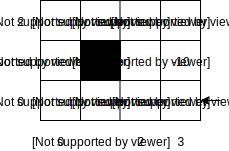

# Markov-Decision-Processes

This project implements some algorithms, such as **Value Iteration** and **Policy Iteration** for calculating the optimal policy of a given Markov Decision Process.

## Problem description

The problem we are trying to solve is a simple 2D grid world problem in which the agent starts off at the grid square (initial state) (3 0) and tries to move to other grid squares located elsewhere with the aim of reaching a terminal state (3 1) or (3 2) while maximizing its gains.

The agent is only allowed actions of moving in up, down, left, right directions by 1 grid square, with probabilities expressed in [transitions.csv](https://github.com/qarchli/Markov-Decision-Processes/blob/master/data/transitions.csv).

The cost of being in each state is shown in the figure below:

&nbsp;&nbsp;&nbsp;&nbsp;

## Usage

`python main.py` or via the [notebook](https://github.com/qarchli/Markov-Decision-Processes/blob/master/Solving%20an%20mdp%20.ipynb)

## Data

**transition_file** contains tuple *(state, action, result-state, probability)*

**reward_file** contains tuple *(state, reward)*
